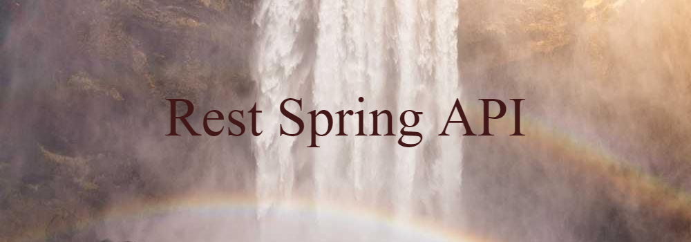
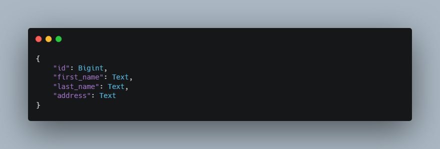

That API is dedicated to study some contents like REST, Serialization, Versioning, Migrations, Security...

To run that Spring Boot application you might have PostgreSQL database installed in your machine and create a new database called "rest_calculator" and the FlyWay gonna take care to populate your tables.

## Calculator Endpoints

## Person Endpoints
You can manage some entities from the Person Model created using JSON, XML or YML.

### API v1
At v1 you can access all the endpoints at the main http://localhost:8080/v1/person endpoint.
There you will be able to POST, GET, PUT and DELETE Persons using the following JSON:

### API v2