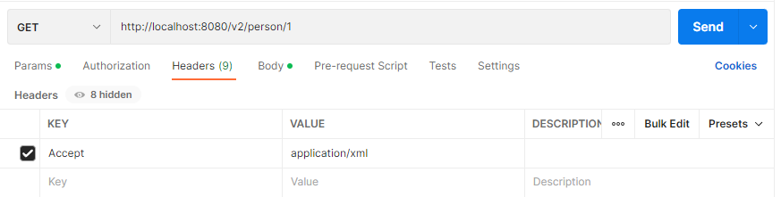

That API is dedicated to study some contents like REST, Serialization, Versioning, Migrations, Security...

To run that Spring Boot application you might have PostgreSQL database installed in your machine and create a new database called "rest_calculator" and the FlyWay gonna take care to populate your tables.

## Calculator Endpoints
You can make some math operations there and have their results at de body of the response.<br/>
GET requests are accepted, only.

````markdown
Add 2 numbers: http://localhost:8080/v1/math/addition/{n1}/{n2}
Subtract 2 numbers: http://localhost:8080/v1/math/subtraction/{n1}/{n2}
Multiply 2 numbers: http://localhost:8080/v1/math/multiplication/{n1}/{n2}
Divide 2 numbers: http://localhost:8080/v1/math/division/{n1}/{n2}
Square from 1 number: http://localhost:8080/v1/math/square/{n1}
Power from 1 number: http://localhost:8080/v1/math/power/{n1}/{n2} // n2 is the power of n1
````

## Person Endpoints
You can manage some entities from the Person Model created using JSON, XML or YML.

### API v1
At v1 you can access all the endpoints at http://localhost:8080/v1/person url.
There you will be able to POST, GET, PUT and DELETE Persons using the following JSON:


### API v2
At v2 you can access all the endpoints at http://localhost:8080/v2/person url.<br/>
There you will be able to POST, GET, PUT and DELETE Persons too, but you can transfer that objects with JSON, XML and YML. At this version the person model will have the "birth_day" field too.


### For JSON Transferring:
By default you can use JSON data format, without any config or additional params at the request.

### For XML Transferring:
To use XML at the data transferring you need to set the following Header key:



After that you will be able to transfer XML data, like the following example:


### For YML Transferring:
To use YML at the data transferring you need to set the following Header key:


After that you will be able to transfer yml data, like the following example:

